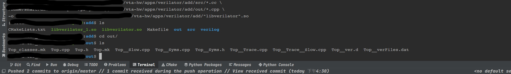

# 从verilog到python代码——使用tvm+verilator的一点简单例子（一）

* 目录
  * 重新编译TVM使其支持verilator
  * 通过Verilator生成仿真代码

* 下期看点
  * 采用TVM Verilator runtime 加载仿真动态库
  * 运行结果
  * vivado综合以及verilog testbench编写
  * vivado仿真波形
  * TVM+Verilator输出波形


* 重新编译TVM使其支持verilator

TVM的功能很多，但是有些需要摸索一下才知道怎么使用。如果想学习给ASIC开发自定义指令集的编译器的话，
我找了一个还不错的例子。这个例子在vta-hw里面，采用verilog实现了一套只有add算子的底层硬件；在常规的开发中
需要写一堆testbench，查看波形来进行测试，这对于写编译器的软件工程师来说比较困难。Verilator作为
一个仿真工具包，可以实现verilog代码转换成C++代码，软件工程师可以直接调用接口实现硬件输出的获取，
仿真时间的控制，激励的触发，并且可以输出波形，相当于用C++来写testbench。让TVM支持Verilator也很简单
只需要在CMake的参数上启动Verilator
```cmake
-DUSE_VERILATOR=ON
```
TVM的Verilator runtime是不依赖verilator的，这个时候还不需要安装Verilator。 TVM的Verilator runtime
主要是将relay/tir下降到驱动层之上的代码。驱动以及硬件层都需要在vta-hw中的apps/verilator中实现。

* 通过Verilator生成仿真代码

vta-hw中的apps/verilator文件下面的Makefile不能用，估计是好久
没有更新了吧，真正的Makefile在apps/verilator/add文件夹下。
该文件夹里面分为驱动层（src）和硬件层（verilog）。verilog里面是那个只有一个算子add的硬件设计
src里面是驱动，暴露出来一下C的接口给TVM Verilator Runtime进行调用。主要是这么几个接口
```c++
extern "C" VerilatorHandle VerilatorAlloc();
extern "C" void VerilatorDealloc(VerilatorHandle handle);
extern "C" int VerilatorRead(VerilatorHandle handle, int id, int addr);
extern "C" void VerilatorWrite(VerilatorHandle handle, int id, int addr, int value);
extern "C" void VerilatorReset(VerilatorHandle handle, int n);
extern "C" void VerilatorRun(VerilatorHandle handle, int n);
```
前两个是资源的申请和释放，VerilatorRead是从指定的地址的寄存器读结果。VerilatorWrite是把输入写入硬件的寄存器；VerilatorReset
重置硬件，让寄存器清零。VerilatorRun进行行为级仿真，在这个里面生成了方波激励信号，驱动硬件进行工作。

在编译硬件以及驱动之前，需要先安装Verilator。官方建议的是4.1以上，我用的是4.110，没啥问题。我用了
Ubuntu 16.04 默认提供的3.8xx也没问题，因为这个硬件也太简单了。。。

在apps/verilator/add文件夹下，输入make，就可以完成verilog到Top.cpp的生成，并且把Top.cpp和src里面driver.cc编译成一个
动态库，也就是驱动。这个驱动暴露了上面提到的6个接口。TVM利用这6个接口，就可以实现目标硬件平台的可执行程序。



编译的结果如上图所示，libverilator.so就是编译好的驱动动态库。out文件夹下面是根据verilog生成的仿真C++文件，其中的Trace文件
是我下一期介绍的功能，我改了一下默认的驱动文件，可以获取每一步仿真结果的同时，还生成波形。关于这个驱动的使用，下期介绍了