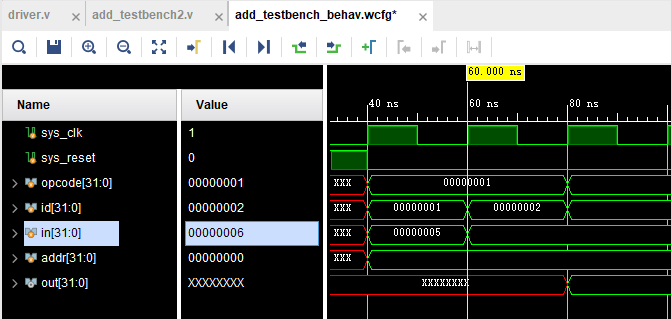

# 从verilog到python代码——使用tvm+verilator的一点简单例子（二）

* 目录
    * vivado综合以及verilog testbench编写
    * vivado仿真波形

* 下期看点
    * 采用TVM Verilator runtime 加载仿真动态库
    * 运行结果
    * TVM+Verilator输出波形

上一篇写了如何开启tvm对verilator的支持，那么verilog本身的时序以及波形是怎样的呢。为了可以更好的理解硬件部分，我把vta-hw
里面system verilog编写的超小型cpu，改成了verilog，并且在vivado里面进行了综合。这个小型的cpu
有load，fetch两个指令，仅实现了把两个数相加这一个功能。整个计算的逻辑是把第一个数load到寄存器A，
再把第二个数load到寄存器B，在每个上升沿硬件自动取寄存器A的数加上寄存器B的数，并放到寄存器C里面去。
遇到fetch指令的时候，就把寄存器C里面的结果返回给用户。 
* vivado综合以及verilog testbench  
指令解析子模块  
用户给过来的指令包含opcode，id，addr，value 这4个部分构成了一个简单的指令集  
```c
    always@(opcode or id or in or addr)  begin
        case(opcode)
            32'd0 : begin  out = 32'hdeadbeef;
            end
            32'd1 : begin
                case(id)
                    32'd1 : wr_a[32*addr+:32] = in;//write_reg_a(in, addr);
                    32'd2 : wr_b[32*addr+:32] = in;//write_reg_b(in, addr);
                endcase
            end
            32'd2 : begin
                case(id)
                    32'd0 : out = 0;//driver.dut[0].cc[32*addr+:32];//read_cc(addr);
                    32'd3 : out = ar_y[32*addr+:32];//read_reg_y(addr);
                endcase
            end
        endcase
    end
```  
当opcode,id,in,或者addr有一个发生改变的时候，也就是新的指令集到来的时候，进行指令的解析，如下表所示：

<table>
<tr>
    <td>opcode</td>
    <td>id</td>
    <td>in</td>
    <td>addr</td>
    <td>指令说明</td>
</tr>
<tr>
    <td>1</td>
    <td>1</td>
    <td>5</td>
    <td>0</td>
    <td>把5放到寄存器A[0]里面去</td>
</tr>
<tr>
    <td>1</td>
    <td>2</td>
    <td>6</td>
    <td>0</td>
    <td>把6放到寄存器B[0]里面去</td>
</tr>
<tr>
    <td>2</td>
    <td>3</td>
    <td>0</td>
    <td>0</td>
    <td>从C[0]中读取结果给用户</td>
</tr>
<tr>
    <td>2</td>
    <td>0</td>
    <td>-</td>
    <td>-</td>
    <td>将结果清零，忽略in和addr</td>
</tr>
</table>
  
计算模块  
计算模块在时钟上升沿的时候，把输入A和输入B相加并输出到C中，为了实现并行化，可以放置多个计算模块，如果带宽增加一些，一次可以计算多对
数据的相加。  
```c
        always @(posedge clock) begin
            if (reset) begin
                sry[32*i+:32] <= 0;
            end
            else begin
                sry[32*i+:32] <= ra[32*i+:32] + rb[32*i+:32];
            end
        end
```  
放置多个“加”  
```c
genvar i;
      generate
        for(i = 1; i <= `LANES; i=i+1) begin
            add #(.LANES(1)) dut (.clock(clock), .reset(reset),
                    .ra(wr_a[32*i-1:32*(i-1)]), .rb(wr_b[32*i-1:32*(i-1)]), .ry(ar_y[32*i-1:32*(i-1)]));
        end
      endgenerate
```  
"`LANES"可以在综合或者编译的时候给定，可以设置放置多少个加法器。  
下面写一个简单的test bench让这套硬件跑起来，然后看一下波形：  
```c
 initial begin
        sys_clk = 1'b1;
        sys_reset = 1'b1;
        #40
        sys_reset = 1'b0;
        opcode=1;id=1;addr=0;in=5;
        #20
        opcode=1;id=2;addr=0;in=6;
        #20
        opcode=2;id=3;addr=0;
    end
    
    always begin 
        #10
        sys_clk = ~sys_clk;
        
    end
```
创建一个时钟，复位以后每隔一个周期，设置一下新的指令，通过仿真，看一下波形吧  



最后计算出来0b这个结果，验证正确。下面将一下怎样使用verilator生成波形。